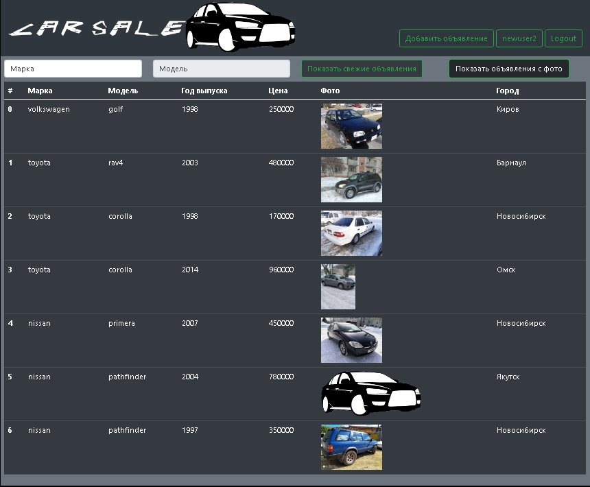

[GIT REPOSITORY](https://github.com/i3acsi/job4j_carsales)

[](https://travis-ci.com/i3acsi/job4j_carsales)
[](https://codecov.io/gh/i3acsi/job4j_carsales)

Проект  Площадка продажи машин.

В системе представлны следующие модели:
 
+ пользователи
+ роли
+ объявления
+ машины
+ двигатели
+ трансмиссии
+ марки
+ модели

Их отношения представлены на UML диаграмме:


Для учебного проекта, думаю, данного уровня детализации моделей достаточно.
- - -

При посещении главной страницы, можно посмотреть активные объявления: 


<br>

Можно применять различные фильтры:
 
* объявления только с фото по умолчанию включено, можно выключить:



*  по Марке авто:


*  по Модели авто:


* Только свежие объявления. Эффект фильтров суммируется 
---

Для того, чтобы можно было размещать объявления, в системе нужно зарегистрироваться и залогиниться:


На станице есть валидация полей.

---
Вообще предусмотрено два типа ролей: USER и ADMIN.

Роль адимна я захардкодил на определенный email при регистрации (rool@loacal.ru), для прочих аккаунтов роль USER

Admin может добавлять Марки, Модели, Двигатели, Транссмиссии:


Можно конечно добавить функционал

---

Пользователь может размещать объявления:


Причем на странице можно добавить свои двигатель/трансмиссию, если их нет в прикрепленном списке.

Есть валидация введенных данных:


Можно отредактировать свой профиль:


Со страницы профиля можно завершить объявление:


---
Как со страницы профиля, так и главной страницы, можно посмотреть объявление, нажав на него:


При этом, просмотр контактов - толоько для авторизованных пользователей.

---
### Аутентификация и Авторизация

При регистрации пользователь передает в теле POST запроса свои данные: имя, телефон, почта, пароль.
Введенные данные валидируются только на странице скриптом валидации с использованием regExp. Введенный пароль шифруется на 
сервере:
```java
 private static String encodePassword(String password) {
        return DigestUtils.sha256Hex(password + SALT);
    }
```
И сохраняется в БД в зашифрованном виде. При аутентификации, пользователь вводит свои данные: почта и пароль.
Соответственно находим пользователя в БД по почте и сверяем пароли:
```java
    public static boolean checkPwd(String input, String stored) {
        return stored.equals(encodePassword(input));
    }
```
И, если проверка пройдена, у сессии у сессии устанавливается атрибут user:
```java
req.getSession().setAttribute("user", account);
```
Авторизация осуществляется с помощью механизма сессий, предоставляемым контейнером сервлетов.
Для этого было реализовано несколько фильров:
* только для адимнского доступа
    * ```java
        @WebFilter(urlPatterns = {"/editDB.jsp"})
        public class AdminFilter extends HttpFilter {
        //...
        }
        ```
* только для авторизованных пользователей
    * ```java
        @WebFilter(urlPatterns = {"/userInfo", "/car"})
        public class AuthFilter extends HttpFilter {
        //...
        }
        
        @WebFilter(urlPatterns = {"/add.jsp", "/account.jsp"})
        public class UserFilter extends HttpFilter {
        //...
        }
        ```
---

### Слой репозитроия

Для хранения и извлечения сущностей, использую Hibernate.
Слой работы с БД включает в себя класс Store, в котором есть статическое поле с SessionFactory и некоторые общие методы.
Есть классы репозитроиев для работы с отдельными классами сущностей, например AccountRepo. И есть есть класс Repo,
агрегирующий функционал всех предыдущих. 

Основным методом класса Store, является метод tx, являющийся транзакионной обертркой над некоторыми действиями, принимаемыми
в арументах функции:
```java
<T> T tx(final Function<Session, T> command) {
        T result = null;
        Transaction tx = null;
        try (Session session = sf.openSession()) {
            tx = session.beginTransaction();
            result = command.apply(session);
            tx.commit();
        } catch (final Exception e) {
            e.printStackTrace();
            if (tx != null)
                tx.rollback();
            throw e;
        }
        return result;
    }
```

Для извлечения некоторых данных, использую DTO. Так например объявление содержит поле owner - связанный с объявлением 
аккаунт. Чтобы не передавать детали аккаунта, в методах GET, возвращающих объявления, использую AnnouncementDto, 
содержащее только Id связанного аккаунта.

---

### Фронт

Для стилизации использую Bootstrap, а так же кастомную стилизацию.

Для каждого View, использую отдельный jsp файл.

Для загрузки необходимых данных на View, зачастую использую AJAX JQuery.

Там, где нужно передать простые данные, например данные заполненных полей, использую json:
```javascript
$.post({
    url: location.origin + '/auto/engine',
    data: {
        'action': 'addEngine',
        'engineName': engineName,
        'enginePower': enginePower,
        'fuel': fuel,
        'engineVolume': engineVolume,
        }
    })
```
Там, где так же нужно передать файл(ы), использую FormData:
```javascript
let data = new FormData();
let userPic = document.getElementById("photo").files[0];
data.append('blob', new Blob([json], {type: 'application/json'}))
data.append('datafile', userPic);
$.post({
        url: url,
        data: data,
        cache: false,
        processData: false,
        contentType: false,
        async: false
        })
```

 ---
 
###  Используемые технологии:
 1. Apache Tomcat — контейнер сервлетов
 2. Java servlets, MVC
 3. JSP
 4. HTML, CSS, JS, Bootstrap, jquery ajax
 5. PostgreSQL, Hibernate, Lombok 
 6. Git, Travis CI, CodeCov